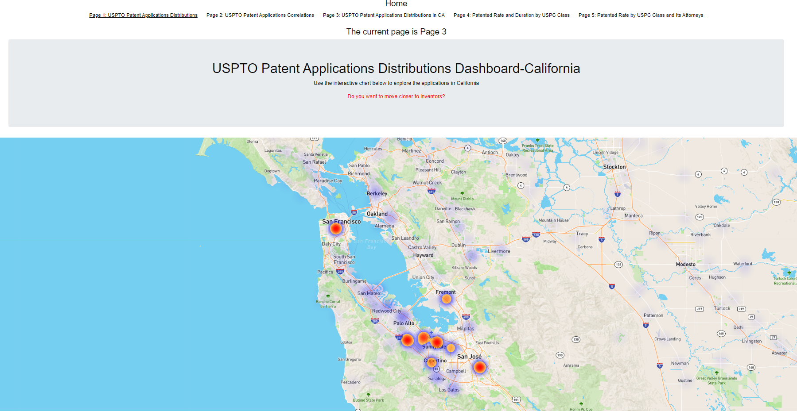

**Please refer to Pattern Patent_Visualization.pptx for my presentation of project 2, which is an extension for Project 1 and ETL. The topic USPTO patents is consistent across my projects**.

# project2-heroku

https://www.uspto.gov/web/patents/classification/selectnumwithtitle.htm

Steps to run the app:
1. Download the repo folder. 
2. Down the 3 json data files from this link https://claycorp-my.sharepoint.com/:f:/r/personal/gongl_claycorp_com/Documents/uspc?csf=1&web=1&e=6Aof5W Replace the 3 json files under project2-heroku-main\project2-heroku-main\ETL_extension_flask\ with the 3 new json files you just downloaded.
3. Open project2-heroku-main\project2-heroku-main\ETL_extension_flask\app.py, Open in Intergrated Terminal, type in python app.py in termial. This will provide the data source routes. http://127.0.0.1:5000/
4. Point to project2-heroku-main\index.html, right click for Open with Live Server (http://127.0.0.1:5500/index.html) or type in python -m http.server in terminal (http://127.0.0.1:8000/index.html). 

## Front Page: It lays out the 5 pages in this web visualization project. 

Welcome to the USPTO patents dashboard!

## Page 1: It provides an interactive choropleth chart for patents distributions in USA. 

## Page 2: It provides an interactive correlation dashboard showing relationships between applications and other factors with D3. 

## Page 3: It provides a heatmap showing applications distributions in California. 

## Page 4: It is the interactive visulization for the Hamlet App presenting the patented rate and time to secure a patent under a uspc class. https://github.com/gongl1/ETL/blob/main/Pattern%20Patent_ETL.pdf

## Page 5: It is the interactive visulization for the HesJustNotThatIntoYou App presenting the patented rates for different attorneys under a uspc class. 

- - -

@ 2021 Liang Gong. All Rights Reserved.
